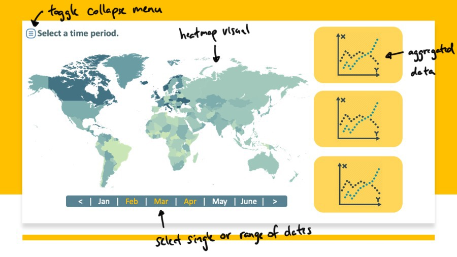
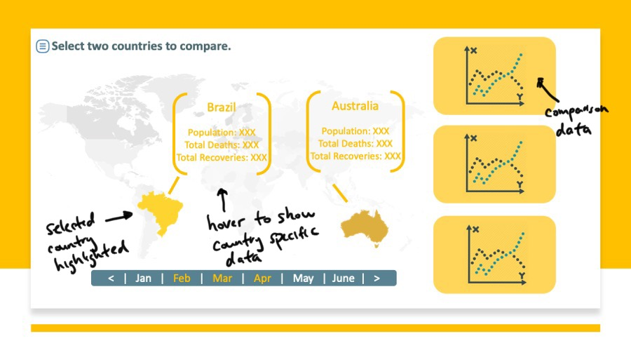

## Motivation and Purpose

* Role: Data Analyst
* Firm: The World Health Organization

COVID-19 pandemic has affected the world drastically during the past year. The purpose of this dashboard, which contains COVID-19-related data, is to present a clear time/location-based picture of the world to better understand the statistics of this pandemic in terms of total cases and recoveries, deaths, and the patterns they follow. This is a very difficult time for all countries, especially for the under-developed and developing countries where an efficient healthcare system is not in place. This data can help us realize which countries are good at handling the pandemic, and which ones are not.

We hope this application can be of service to healthcare officials all around the globe in order to have a better picture of this pandemic in the language of numbers and help them with their decision-making policies.

## Description of the data

The COVID-19 dataset that we are planning to use for this Dashboard is from [Kaggle](https://www.kaggle.com/imdevskp/corona-virus-report), which was last updated on 6th August 2020. In particular, we are interested in the data containing in the **full_grouped.csv** file as it is the most comprehensive in terms of countries recorded and the dates included. Unfortunately, it only includes data from 22nd January 2020, the pandemic's start, to 27th July 2020, which spans 187 days. In total, 187 countries are reporting their daily statistics. However, due to various reasons, not all countries can record statistics for the whole period.

Each observation is COVID-19 statistics for a particular country on a specific day, sorted chronologically based on the date recorded and alphabetically based on the country name. Each country is associated with a region defined by WHO in `WHO Region` column, which can serve the purpose of aggregating data into continents. Besides, there are two groups of statistical data that are in our interest. The first group is cumulative data from the beginning of the pandemic including the total number of confirmed cases (`Confirmed`), the total number of deaths (`Deaths`), the number of people who have recovered (`Recovered`) and the count of those who are still infected (`Active`). Those who are still infected are computed by deducting deceased and recovered patients from the total number of confirmed cases. On the other hand, the second group is daily data comprising new cases (`New cases`), new deaths (`New deaths`) and newly recovered people (`New recovered`).

In addition, we also make use of the population data for each country contained in the **worldometer_data.csv** file. We can match this information in the `Population` column with those mentioned above based on the `Country/Region` column.

## Reseach Question and Usage Scenario

Some research questions that could be answered by this dashboard are:

* Which country and region have the most cases, deaths and recoveries?
* How are the pandemic trends (such as Total cases and/or Deaths ) changing over a specific time span for a target Country/Region?
* Which country out of the two selected countries are affected the most and their trends of cases, deaths, and recoveries over the time period?

Example User:

Dr. Jerry Bing is an Epidemiologist. Every day he is tasked to report his suggestions to the Director-General, for the countries where the new cases are increasing sharply. So he needs a dashboard having clear and precise data representation from which he can analyze and make decisions about what other precautions or help can be provided to these countries. He can look into the summary of cases, recoveries and total deaths, and can also filter it using the Country and Region column. When he selects the Asia Pacific region (either by clicking on the region or selecting from the drop-down), it will break the data down into countries. When he does so, he realizes that Asian countries that are next to China, the epicenter of the pandemic, have high cases in January but significantly lower cases in July compared to European or North American counterparts. He hypothesizes that other factors such as how early lockdowns were imposed and how obedient their citizens were may affect the number of daily cases. He decides to conduct a follow-on study since this information is not captured in his current dataset.

## App Sketch

The purpose of this app is to allow users to explore global COVID-19 data by time and region in an intuitive manner. The app sketch can be found below with additional details in the [README](../README.md).

